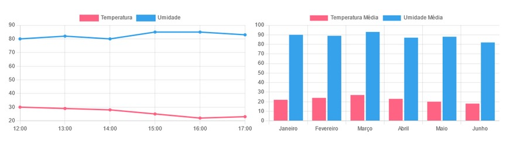

# atividadeChartJS

Crie uma página HTML e utilize a biblioteca "Chart.JS" como foi explicado, criando uma dashboard como a imagem abaixo:

--- 

**Caso queira, pode adicionar CSS à página!**

**Formato de entrega:**
Crie um repositório PÚBLICO para subir o código desenvolvido, e envie o endereço do GitHub contendo seu repositório PÚBLICO com os arquivos criados para esta tarefa.
